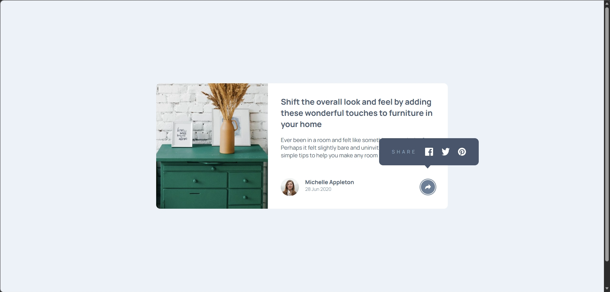

# Frontend Mentor - Article preview component solution

This is a solution to the [Article preview component challenge on Frontend Mentor](https://www.frontendmentor.io/challenges/article-preview-component-dYBN_pYFT). Frontend Mentor challenges help you improve your coding skills by building realistic projects.

## Table of contents

- [Overview](#overview)
  - [The challenge](#the-challenge)
  - [Screenshot](#screenshot)
  - [Links](#links)
- [My process](#my-process)
  - [Built with](#built-with)
  - [What I learned](#what-i-learned)

**Note: Delete this note and update the table of contents based on what sections you keep.**

## Overview

### The challenge

Users should be able to:

- View the optimal layout for the component depending on their device's screen size
- See the social media share links when they click the share icon

### Screenshot



### Links

- Solution URL: (https://github.com/GraceRosario/article-preview-component)
- Live Site URL: (https://gracerosario.github.io/article-preview-component/)

## My process

### Built with

- Semantic HTML5 markup
- CSS custom properties
- Flexbox
- CSS Grid
- Mobile-first workflow

### What I learned

In this challenge, I implemented a tooltip using a state-based class pattern. Instead of manipulating multiple elements in JavaScript, I toggled a modifier class on the main card component and handled UI changes through CSS.

```css
.card--share-active .card__user-info {
  display: none;
}

.card--share-active .share-button {
  background-color: #6d7f97;
}
```

```js
shareBtn.addEventListener("click", (e) => {
  card.classList.toggle("card--share-active");
});
```

I also improved accessibility by allowing the tooltip to close when the Escape key is pressed.

```js
shareBtn.addEventListener("keydown", (e) => {
  if (e.key === "Escape") {
    card.classList.remove("card--share-active");
  }
});
```

## Author

- Frontend Mentor - [@GraceRosario](https://www.frontendmentor.io/profile/GraceRosario)

